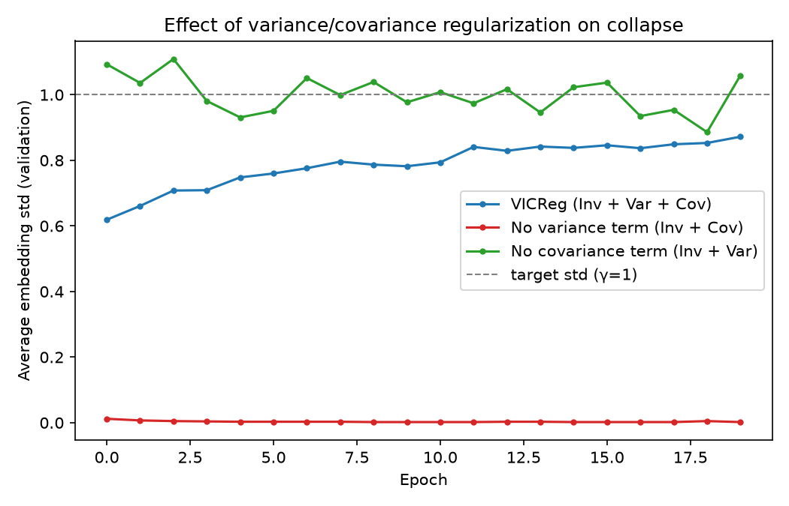

# VICReg From Scratch

Implémentation from scratch (PyTorch) de **VICReg** (*Variance-Invariance-Covariance
Regularization for Self-Supervised Learning*, Bardes, Ponce & LeCun, ICLR 2022),
entraînée sur CIFAR-10, avec une expérience d'ablation qui démontre concrètement
l'effet de chaque terme de régularisation sur l'effondrement des représentations.

## Le principe

Deux vues augmentées de la même image sont encodées séparément, puis une loss à
trois termes s'applique sur leurs embeddings :

- **Invariance** : rapproche les deux embeddings (ils doivent représenter la même image).
- **Variance** : maintient l'écart-type de chaque dimension au-dessus d'un seuil sur le batch,
  empêche l'effondrement vers un vecteur constant.
- **Covariance** : décorrèle les paires de dimensions, empêche la redondance d'information.

Contrairement à BYOL, SimSiam ou I-JEPA, VICReg n'a **ni stop-gradient, ni momentum
encoder, ni poids partagés obligatoires** : les deux branches sont entraînées par
backprop classique, en même temps. C'est la régularisation explicite (variance +
covariance) qui empêche le collapse, pas une astuce architecturale.

```
Image → deux vues augmentées (crop, couleur, flip, grayscale)
      → Encoder (CNN + global average pooling) partagé
      → Expander (MLP, dimension plus grande que la représentation)
      → Loss = λ·Invariance + μ·Variance + ν·Covariance
```

## Structure du projet

```
vicreg-from-scratch/
├── config.py          # architecture, hyperparamètres, coefficients de la loss
├── model.py            # Encoder (CNN) + Expander (MLP)
├── augmentations.py    # les deux vues augmentées
├── vicreg_loss.py       # invariance, variance, covariance
├── dataset.py           # CIFAR-10 (pretrain train/val split + probe train/test)
├── train_vicreg.py      # boucle d'entraînement + runs d'ablation
├── plot_results.py      # génère le graphique ci-dessous à partir des logs
└── requirements.txt
```

## Simplifications par rapport au papier original

- **CNN léger** (3 blocs conv, ~256-d en sortie) au lieu d'un ResNet-50 — suffisant
  pour démontrer le mécanisme sur CIFAR-10, jouable sur GPU gratuit (Colab).
- **Augmentations adaptées à 32×32** : flou gaussien et solarisation retirés (pensés
  pour du 224×224 dans le papier), crop/couleur/flip/grayscale conservés.
- **20 epochs** au lieu de 1000, coefficients de loss (`λ=μ=25, ν=1`) repris tels quels
  du papier (section 4.2), sans grid search sur CIFAR-10.

## Installation

```bash
uv venv
uv pip install -r requirements.txt
```

L'entraînement (3 configs d'ablation à la suite) est plus rapide sur GPU. Testé
sur **Google Colab (GPU T4 gratuit)**.

## Utilisation

```bash
python train_vicreg.py
```

Lance séquentiellement 3 configurations, 20 epochs chacune :

| Config | Variance | Covariance |
|---|---|---|
| `vicreg_full` | ✅ | ✅ |
| `no_variance` | ❌ | ✅ |
| `no_covariance` | ✅ | ❌ |

Pour chaque config, à chaque epoch : loss + écart-type moyen des embeddings (train
et val, split held-out indépendant du split test réservé à une éventuelle évaluation
en aval). Le meilleur checkpoint (`encoder.pth`) n'est sauvegardé que pour la config
complète.

## Résultat : l'effet de la régularisation, mesuré



| Config | Écart-type final (val) |
|---|---|
| `vicreg_full` | 0.872 |
| `no_variance` | **0.002** |
| `no_covariance` | 1.059 |

**Sans le terme de variance, le réseau collapse en moins d'une epoch** : la loss
(qui ne contient plus que le terme d'invariance) tombe à quasi-zéro dès l'epoch 1,
et l'écart-type moyen des embeddings s'effondre de 0.54 à 0.002 — la solution
triviale (tous les embeddings identiques) minimise parfaitement une loss qui ne
pénalise que l'écart entre les deux vues, sans jamais imposer de dispersion.

`vicreg_full` converge progressivement vers l'écart-type cible `γ=1` sans jamais
collapse. `no_covariance` ne collapse pas non plus — logique : le terme de variance
seul suffit à empêcher l'effondrement *géométrique* (vecteur constant). Ce que cette
métrique ne montre **pas**, c'est l'effondrement *informationnel* que le terme de
covariance est censé prévenir (des dimensions différentes mais redondantes/corrélées
entre elles) — une limite assumée de cette expérience : mesurer ça nécessiterait un
diagnostic différent (le coefficient de corrélation moyen entre paires de dimensions,
utilisé en Figure 5 du papier), qu'on n'a pas implémenté ici.

## Références

- Bardes, Ponce & LeCun, *VICReg: Variance-Invariance-Covariance Regularization for
  Self-Supervised Learning*, ICLR 2022 ([arXiv:2105.04906](https://arxiv.org/abs/2105.04906))
